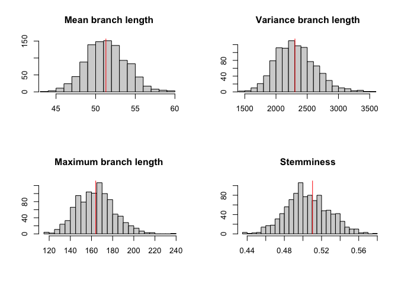
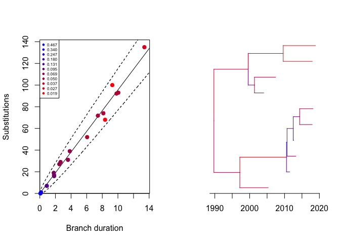
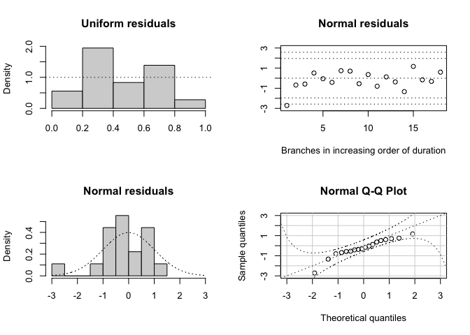
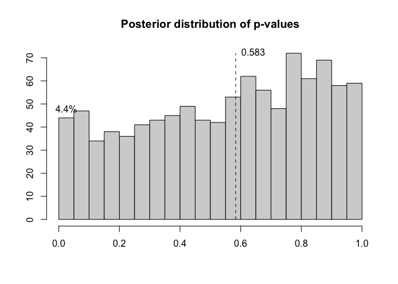

<!-- README.md is generated from README.Rmd. Please edit that file -->

# Introduction

The aim of this package is to check if a dated phylogeny is valid. Many
tools exist to produce dated phylogenies, but there are several factors
that can invalidate the results. This includes the confounding effect
that population structure can have on dating. But it also includes
incorrect assumptions made when running a dating analysis, for example
using an inappropriate clock model.

## Installation

You can install DiagnoDating from github with:

``` r
devtools::install_github("xavierdidelot/DiagnoDating")
```

The package can then be loaded using:

``` r
library(DiagnoDating,quietly=T)
```

## Example

This is a basic example of usage. First we generate a dated tree with 10
samples between 2000 and 2020:

``` r
dates=runif(10,2000,2020)
dt=simcoaltree(dates)
plot(dt)
axisPhylo(backward=F)
```

<!-- -->

Next we generate a phylogenetic tree using a Poisson(10) mutation model,
and perform a root-to-tip analysis:

``` r
phy=simobsphy(dt,mu=10,model='poisson')
r=roottotip(phy,dates)
```

<!-- -->

We can run the dating analysis on this phylogeny as follows:

``` r
r=runDating(phy,dates)
plot(r)
```

<!-- -->

We can perform a posterior predictive check:

``` r
p=ppcheck(r,showPlot = T,showProgress = F)
```

<!-- -->

We can see the likelihood of each branch:

``` r
plotLikBranches(r)
```

<!-- -->

We can compute the residuals:

``` r
plotResid(r)
```

<!-- -->

We can compute the posterior distribution of residual p-values:

``` r
p=postdistpvals(r,showPlot = T)
```

<!-- -->

## More information and getting help

For more detailed examples of how to use DiagnoDating, see the vignettes
[here](https://github.com/xavierdidelot/DiagnoDating/tree/master/vignettes).
See also the help included in the package using the R command
`help(package='DiagnoDating')`.

If you have any problem or question please create an issue
[here](https://github.com/xavierdidelot/DiagnoDating/issues) or get in
touch by emailing `xavier.didelot@gmail.com`
